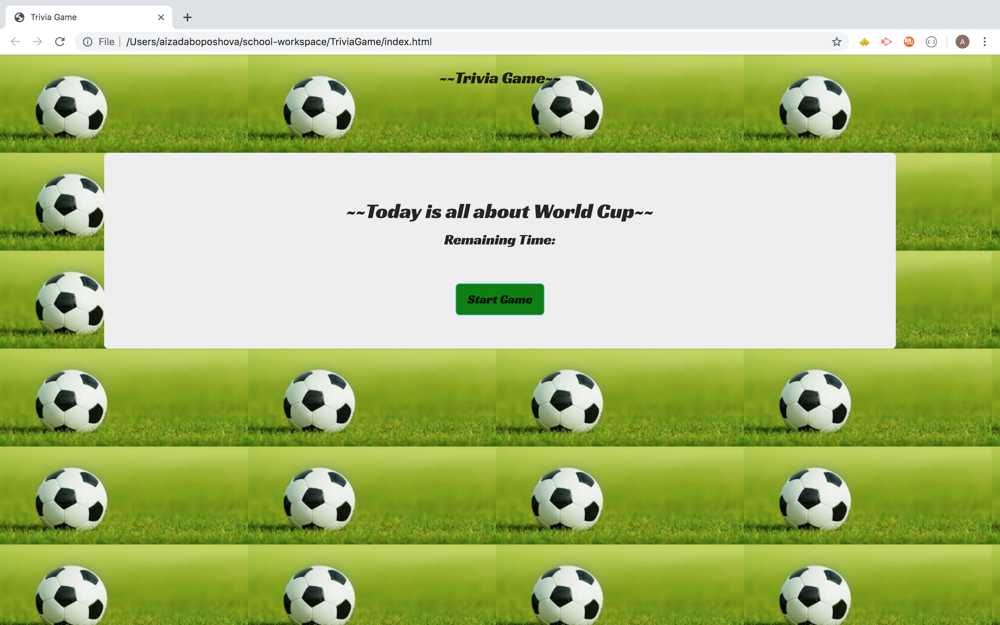

# TriviaGame

* This is Trivia Game that shows the player 7 total question in general.
* If the player selects the correct/wrong answer it will show statement t'he answer is correct/incorrect', and next question starts.
* For each question player is given 12 sec to select the answer from 4 options.
* If the player runs out of time, 'Time Out' message will display on the screen.
* If you choose to replay the game simply hit start button again!
* Pretty straightforward right, Enjoy the game now! 

 
